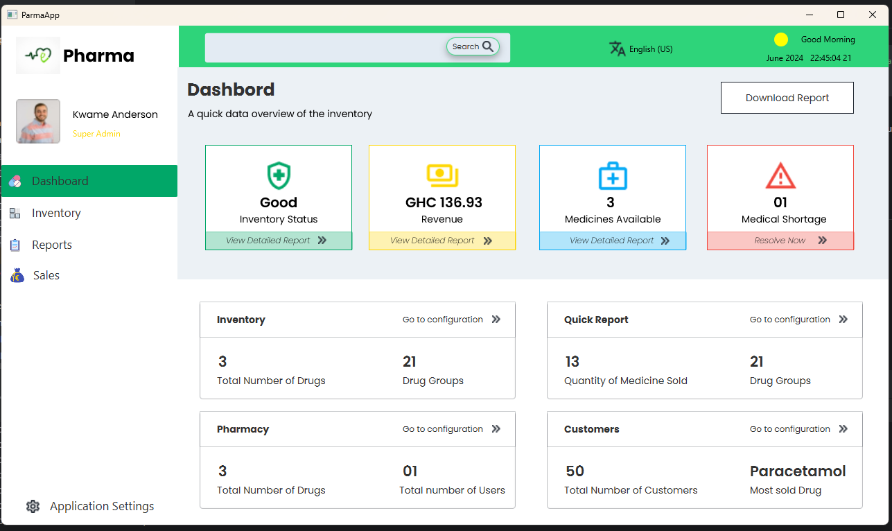
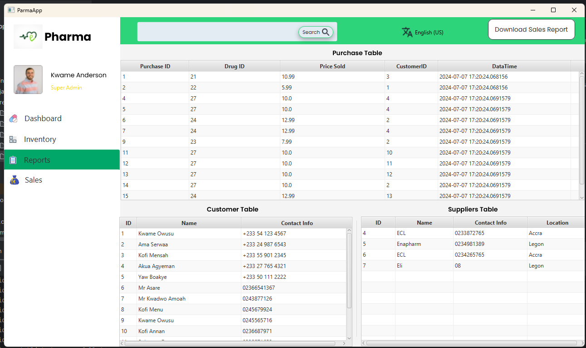
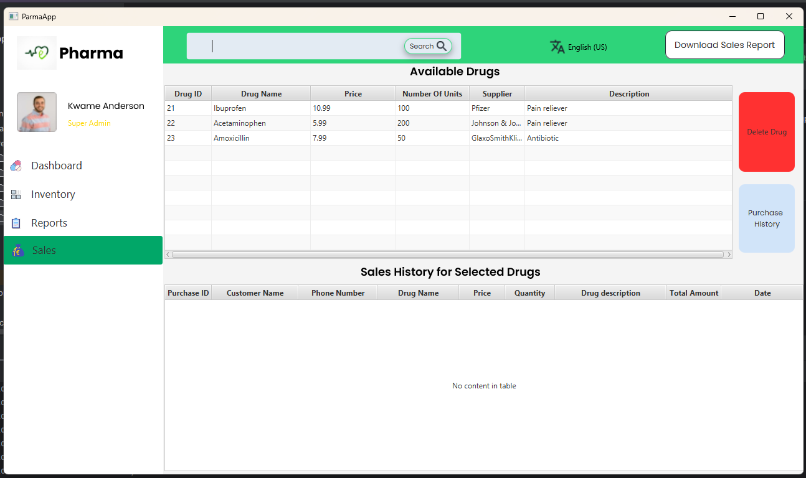

# Pharmacy Management System

This is a simple pharmacy management application developed in Java using JavaFX for the front-end and MySQL for the back-end database. The application allows for managing the pharmacy system with various features such as adding drugs, searching for drugs, viewing all drugs and their suppliers, and viewing purchase history with detailed information.

## Features

- **Add Drugs:** Allows users to add new drugs to the system.
- **Search for a Drug:** Provides functionality to search for a specific drug.
- **View All Drugs and Their Suppliers:** Displays a list of all drugs along with their suppliers.
- **View Purchase History:** Shows the purchase history for each drug with detailed information on the time, date, and buyer.

## Requirements Met

1. **Data Structures:**
    - The collection of drugs is represented using `ObservableList<Drug>` (see `InventoryController.java`).

2. **Drug Management:**
    - Addition: Drugs are added through the `addButtonClicked` method using form inputs (see `InventoryController.java`).
    - Removal and Selection: Drugs can be selected and managed using TableView (see `initialize` and `loadDrugData` methods in `InventoryController.java`).

3. **Purchase History:**
    - The purchase history for each drug is stored in the `Purchase` table and is managed using SQL queries (see `addPurchaseToDatabase` and `processDrugSale` methods in `InventoryController.java`).

4. **Suppliers:**
    - Each drug is linked to a supplier using a `Map<Drug, List<Supplier>>` structure (see `addSupplierToDatabase` method in `InventoryController.java`).

5. **Techniques Used:**
    - Iterators: Used to iterate through drug lists (see `searchButtonClicked` method).
    - Recursion: Implemented in search functionality.
    - Stack and Queue: Used to manage drug sales and purchase history (see `processDrugSale` method).

6. **Sales Tracking:**
    - Sales are tracked using a sales report generated and stored in files (see commented `writeToFile` method).

7. **Suppliers and Customers:**
    - Information about suppliers and customers is stored using appropriate data structures (see `addSupplierToDatabase` and `addCustomerToDatabase` methods).

## Prerequisites

- Java Development Kit (JDK) version 22
- JavaFX
- MySQL
- IntelliJ IDEA (recommended for development)

## Setup Instructions

1. **Clone the Repository:**
   ```bash
   git clone https://github.com/yeli-bigman/pharmaApp.git
   cd pharmaApp
2. **Create MySQL Database:**

 - Open a command prompt and create a mysql database
   
      ````bash
   mysql -u [username] -p
   creat database pharmacyDB;
   use pharmacyDB;
   
   
 - run the following command to create the MySQL database and import the initial database schema:

   ````bash
       cmd /c "mysql -u [mysql_username] -p pharmacyDB < src\main\resources\databaseBackupDump\pharmacy_init_DB.sql"
    
   
3. **Update Database Configuration:**

    After creating the MySQL database and importing the database, ensure to update the user and password in `src/main/java/com/example/pharmaapp/database/sql/dbConnection.java`.


4. **Run the Application:**

    Open IntelliJ IDEA, import the project, and run the Main class.

----
## Screenshots

Dashboard:


Inventory:


Sales:


Reports:

